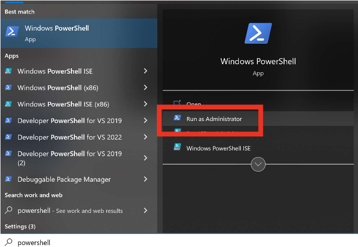

# WSL Installation Guide

Welcome to the WSL Installation Guide! This document will guide you through the process of installing the Windows Subsystem for Linux (WSL) on your Windows machine.

## Step 1: Verify Windows Version

Before we start, make sure you're running Windows 10, as WSL requires it.

## Step 2: Open PowerShell as Administrator

Search for "PowerShell" in the Start menu, right-click on it, and choose "Run as administrator".

**tip** - To find PowerShell, click on the magnifying glass icon in the bottom left of the screen and type in “powershell”



## Step 3: Install WSL

In the PowerShell console, type the following command and press Enter:

```bash
wsl --install
```


Your system will begin installing WSL.


## Step 4: Reboot Your Computer

Once the installation is complete, you'll be prompted to restart your computer. Please do so.

## Step 5: Set Up Ubuntu

After restarting, Ubuntu should automatically continue the installation process. You'll be asked to create a username (all lower case and ideally no spaces) and password.

### Is Ubuntu doesn't start automatically

If Ubuntu doesn't automatically start, you can find it in the Start menu and open it manually.

No Ubuntu listed? 

- After this is complete open PowerShell as Administrator again.

- Check your WSL version is version 2 by typing wsl --list --verbose and press Enter.

- If you get a message saying that WSL is installed but you have no distribution, type `wsl -–install -d ubuntu` and press Enter.

- If your version is showing as version 1, type `wsl --set-version Ubuntu 2` and press Enter.

- Now open the Ubuntu app from the Start menu:


- In the Ubuntu console window that appears, run the following commands one by one:

``` bash
sudo apt-get update
sudo apt-get upgrade
sudo apt-get dist-upgrade
sudo apt-get autoremove
```

## Step 6: Verify WSL Version

Open PowerShell as an administrator again and check your WSL version by typing:

```bash
wsl --list --verbose
```

Make sure it says you're running version 2.

## Step 7: Accessing Files

You can access your Linux files from Windows by navigating to `\\wsl$\` in the File Explorer.


Your installed Linux distros are listed, so you can access the Ubuntu root directory at `\\wsl$\ubuntu`.

Your personal files will typically be stored at `\\wsl$\ubuntu\home\<yourname>`

## Step 8: Installing Applications

Remember, you're running two operating systems, so you might need to install certain applications on both. For example, to install Git on Ubuntu, open the Ubuntu console and type:

```bash
sudo apt update
sudo apt install git
```

And that's it! You've successfully installed WSL on your Windows machine. Enjoy exploring!
